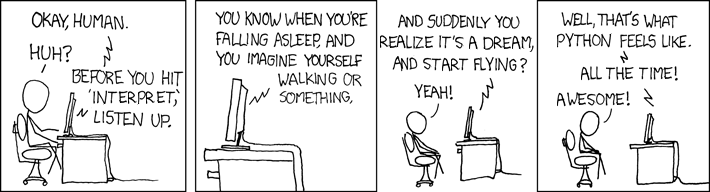
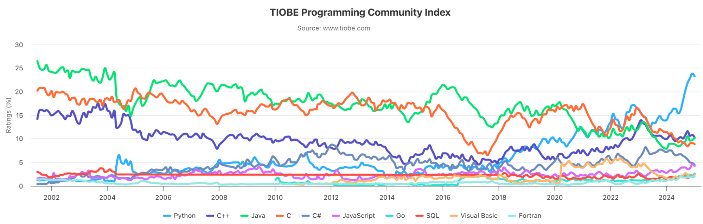

# Digitmind

Around June 2023, the scripting language [Python](https://www.python.org/) rose to the 1st place of the [TIOBE Programming Community](https://www.tiobe.com/tiobe-index) index and stayed there ever since.

One of the major drivers of this is the fact that Python is the language of choice in most AI  projects nowadays.

When learning a new programming language I always find it helpful to go beyond the obligatory “Hello world” and program the game [Mastermind](https://en.wikipedia.org/wiki/Mastermind_(board_game)). To date I’ve done this for [Extended Basic](https://en.wikipedia.org/wiki/TI_Extended_BASIC), [Turbo Pascal](https://en.wikipedia.org/wiki/Turbo_Pascal), [Delphi](https://en.wikipedia.org/wiki/Object_Pascal), C/C++, [COBOL](https://en.wikipedia.org/wiki/COBOL) and Objective-C.

For Python I documented this process [here](design.pdf). As such this document contains the software design of a *Digitmind* game written in Python. The game is based on [MasterMind](https://en.wikipedia.org/wiki/Mastermind_(board_game)), but instead of colors one has to guess a code of 4 different digits.

Focusing on core mechanics, the program uses the command line, so no GUI design rules were broken during this process…

By the way - for convenience the final program is available on this repository ([`main.py`](main.py) and [`score_calculators.py`](score_calculators.py)).

My goal with this is also to give the novice Python programmer a fun introduction into some of the powerful features of the language.

*February 2025, Fred Dijkstra* 🤓

